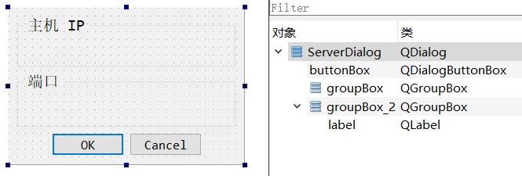
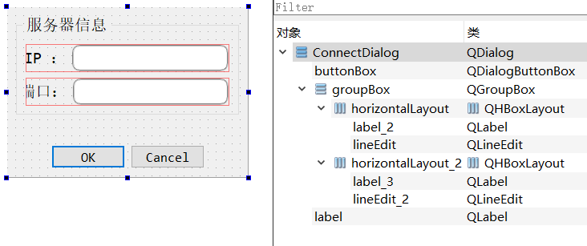
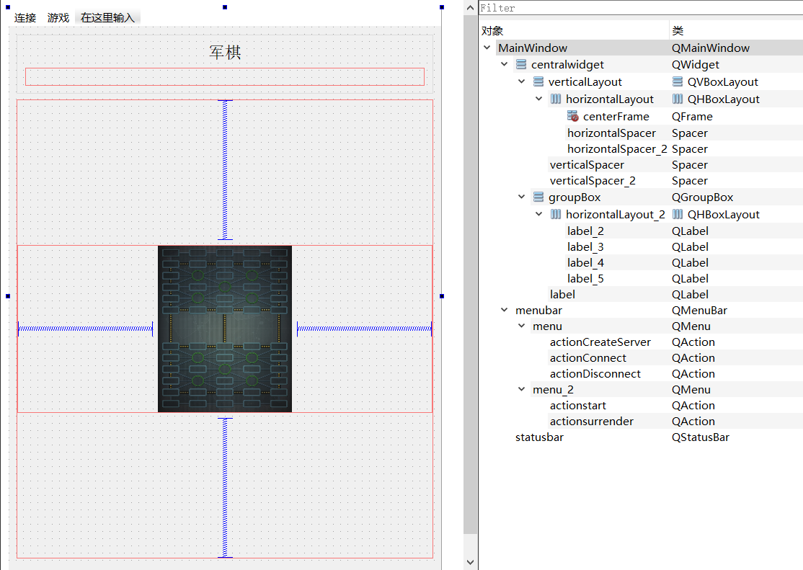

# ArmyChess

基于 `Qt6.1.2` 的程序设计训练课程作业 `ArmyChess`

作业与文档编写时使用环境为： `Win10 21H1 Build 19043.1165 家庭中文版` + `CMake 3.21.1` + `g++ (x86_64-posix-seh-rev0, Built by MinGW-W64 project) 8.1.0`

## 设计简介

### 各模块概要

- `framework`：游戏功能
  - [`game`](#game)：游戏后端，提供游戏运行相关的功能
- `network`：网络功能
  - [`network`](#network)：网络后端，提供网络通信相关接口
- `widget`：GUI 组件
  - [`chessbutton`](#chessbutton)：游戏中作为棋子的按钮
  - [`server_dialog`](#server_dialog)：创建服务器对话框
  - [`connect_dialog`](#connect_dialog)：连接服务器对话框
- [`mainwindow`](#mainwindow)：程序主界面，组合各个模块，提供游戏界面与交互

#### `game`

`game` 模块负责执行游戏逻辑，不负责超时/投降等游戏外部因素处理。

`game` 模块实现了一个 `Game` 类用于游戏的交互。`Game` 类存放了玩家信息，并提供了翻开棋子、吃子（包括移动不吃子）、获取某个节点上棋子的可行节点列表、判定输赢等接口。

`Game` 对象中存放了 60 个 `Node` 对象，对应棋盘中的 60 个可走位置，`Node` 对象记录当前节点属性（是否行营）以及节点联通信息（公路相邻点、铁路相邻点）。

`Node` 对象上可以放置 `Chess` 类。`Chess` 类记录棋子颜色，角色，是否隐藏等棋子信息，并提供判断能否吃掉另一个棋子的功能。

`Game` 对象的构造代表着游戏的开始，构造时会以当前时间为随机种子随机生成棋盘布局和先手玩家，初始时所有棋子均隐藏。

使用 `Game` 对象进行游戏，需要在每轮开始时执行 `BeforeTurn` 函数，结束后执行 `AfterTurn` 函数，从而保证棋局的更新轮替以及胜负判断的实时性。

游戏中应随时调用 `Game` 对象的 `GetWinner` 函数检测是否已经分出胜负。

`Game` 类还提供了导出至二进制数据（`ExportToByte`）和从二进制数据（`LoadFromByte`）中载入的功能。

#### `network`

`network` 模块负责网络相关功能。

基类 `Network` 类使用 `QTcpSocket` 进行网络通信，提供了验证连接、断开连接、收发数据，封包拆包的功能。收发包使用 `QByteArray` 作为二进制数据载体，在每个包前添加 4 字节包大小用于处理 TCP 粘包。可以调用 `DisconnectNow` 断开连接，使用 `SendPackage` 发送二进制数据。当连接完成并完成连接验证时，会发出 `SuccessConnection` 信号；当连接断开时，会发出 `Disconnect` 信号；当拆出一个完整包时，会发出 `package_get` 信号。

`Server` 类继承自 `Network` 类，用于创建服务器。在构造时会在随机端口创建 `QTcpServer` 并进行监听，当有一个客户端连接时关闭监听，并向客户端发送验证数据包（字符串 `7335608`），发出 `SuccessConnection` 信号。可以使用 `GetIP` 获得当前主机 IPv4 地址列表，使用 `GetPort` 获得服务器端口。

`Client` 类继承自 `Network` 类，用于连接服务器。当使用 `TryConnect` 尝试连接至对应 IP 和端口时，`Client` 对象会在对应时间限制（默认5000ms）内尝试连接服务器，若连接成功并收到验证数据包（字符串 `7335608`），则发出 `SuccessConnection` 信号。

#### `chessbutton`

`chessbutton` 模块实现了 `ChessButton` 类，用于设置棋子的交互效果，载入棋子图标和资源。

`ChessButton` 类继承自 `QPushButton` 类，可以根据棋子角色载入相关资源作为图标，并动态切换是否能够被点击，以及是否显示可行节点标识。

当被点击时，会发出 `chess_clicked` 信号。

#### `server_dialog`

`server_dialog` 模块实现了 `ServerDialog` 类，负责创建服务器的相关交互。

    

`ServerDialog` 类继承自 `QDialog` 类，在构造时需提供 IP 地址列表和服务器端口号。

#### `connect_dialog`

`connect_dialog` 模块实现了 `ConnectDialog` 类，负责连接服务器的相关交互。

    

`ConnectDialog` 类继承自 `QDialog` 类。在点击 OK 按钮后**不会**直接转至 `QDialog::accept` 槽，而是会先检查 IP 地址和端口是否合法（检查 IP 使用正则表达式，检查端口使用 `QString` 的 `toInt` 功能），如有误则显示错误信息，如正确然后发出 `Connect` 信号通知主程序尝试连接，成功连接后才能正常转至 `QDialog::accept` 槽。

#### `mainwindow`

`mainwindow` 模块负责整个主界面、游戏、网络的控制。

    

程序开始运行，便进入 `mainwindow` 模块，显示主界面，并初始化游戏参数和网络参数。

主界面将素材（棋盘、棋子等）摆放至对应位置，并会根据窗口的 `resize` 事件自动调整素材的大小与位置。

进入时，默认为单机模式，可以进行创建服务器、连接至服务器、开始游戏的动作。

##### 窗口调整

当发生 `resizeEvent` 时，`Resize` 函数将会计算棋盘的可用空间大小，然后调整棋盘大小使其长宽比基本不变，同时根据棋盘中标定点计算按钮位置，重新放置按钮。

##### 开始游戏

当收到开始游戏信号，对应槽执行 `StartGame` 函数。该函数会先执行 `GameClear` 函数清理上一轮游戏数据，并新建一轮游戏，初始化 `Game` 对象 `game_`，同时将所有棋子置为 `disable`。接着，如果当前为在线模式，会发送游戏初始数据（作为服务端）或从收到的数据中载入游戏（作为客户端）。然后将重新更新界面中所有棋子按钮数据，最后执行 `BeforeTurn` 进行一轮游戏前的准备。

在 `BeforeTurn` 函数中，首先会执行 `game_` 的 `BeforeTurn` 函数，然后若为在线模式，则根据当前游戏方判断是否将所有棋子置为 `disable` 并锁住，最后进行步数统计、开始这一轮的计时并在主界面中显示相关信息，无棋可走的胜负判断也在这儿进行。

接下来开始等待玩家操作棋子。操作来源可以为本地点击和网络收包。操作棋子可以选中棋子、移动、吃子等，棋子图标与标识也会根据操作更新。

某些操作（吃子、移动、超时等）会造成游戏进入下一轮，这时会进入 `AfterTurn` 处理胜负与超时，然后进入 `BeforeTurn` 开始下一轮游戏。

##### 游戏获胜

当游戏在 `BeforeTurn` 或 `AfterTurn` 中检测到游戏结束时，会调用 `EndGame` 函数结束游戏。`EndGame` 将禁用所有按钮棋子，并弹窗显示获胜信息和获胜方，并发出 `GameOver` 信号，用于关闭当前除主界面外的窗口（实际上只有投降窗口）。

##### 创建服务器

当收到创建服务器信号，对应槽尝试创建 `Server` 对象来创建服务器，若失败会弹出对应信息窗口，若成功则会弹出 `server_dialog` 窗口显示服务器相关信息，并初始化在线游戏参数，若此时收到 `Disconnect` 信号则会转至 `ServerDialog::reject` 槽关闭窗口。若 `server_dialog` 窗口退出时信息不为 `QDialog::Accepted` 则会关闭服务器。

##### 连接服务器

当收到创建服务器信号，对应槽创建 `Client` 对象，弹出连接 `connect_dialog` 对话框，将 `connect_dialog` 的 `Connect` 信号连接至执行 `Client` 对象连接函数的槽，并将 `Client` 对象的 `SuccessConnection` 信号连接至 `connect_dialog` 对话框的 `accept` 槽。若成功连接则会初始化在线游戏参数，否则会清理当前 `Client` 对象。

##### 断开服务器

当处于连接中时，可执行断开连接动作。该动作会尝试断开连接，删除 `socket`，结束游戏，返回单机模式，设置对应参数。

##### 投降

当总步数到达 20 步时，投降功能被激活。点击投降会弹出投降确认框，确认后执行投降并发送相应数据包（在线模式下）。

##### 通信协议

建立连接时，由服务器发送字符串 `7335608` 尝试确认连接，客户端收到后即完成连接确认。

开始游戏时，由服务器发送 102 字节的棋盘数据包，第一个字节为字符 `B`，第二个字节为 `bool` `0` 或 `1`，表示先手玩家是否为客户端，然后 100 个字节，2 字节为一组，表示对应非行营节点上棋子的颜色和角色。客户端收到该数据包后，开始游戏。

游戏中，走子方在点击按钮时发送 2 字节的走子数据包，第一个字节为字符 `C`，第二个字节为点击的按钮编号。

游戏中，走子方在超时时发送 1 字节的超时数据包，第一个字节为字符 `T`。非走子方在走子方超时后等待该数据包，若在超时时间（默认 5000ms）内收到则确认超时，若未收到则视为断开连接。

游戏中，双方均可在条件达到时进行投降，同时发送 1 字节的投降数据包，第一个字节为字符 `S`。对方收到后进行投降结算。
